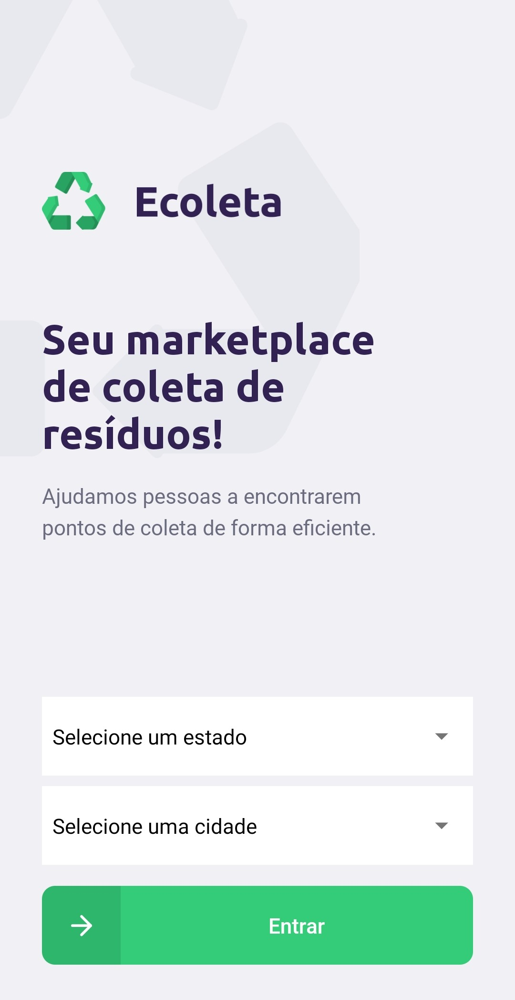
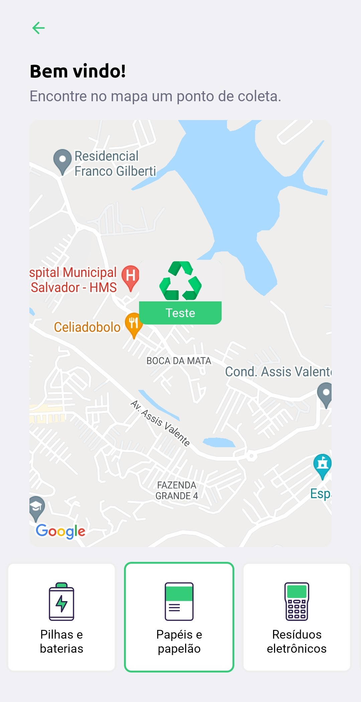
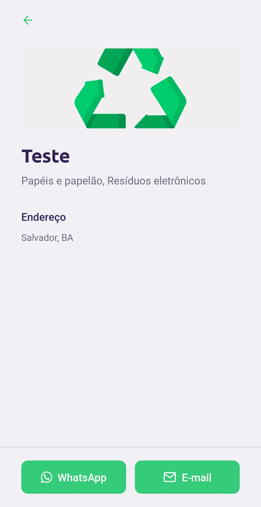
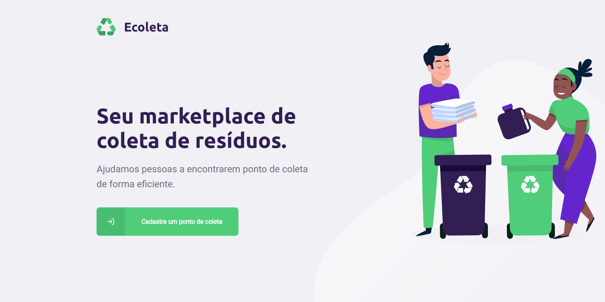
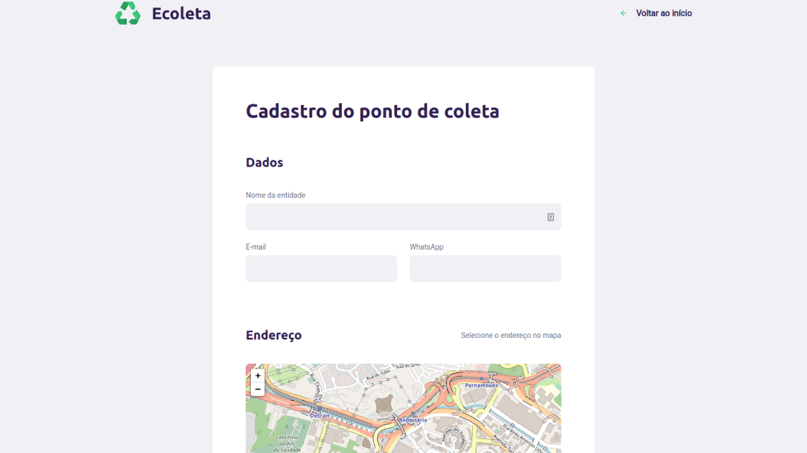
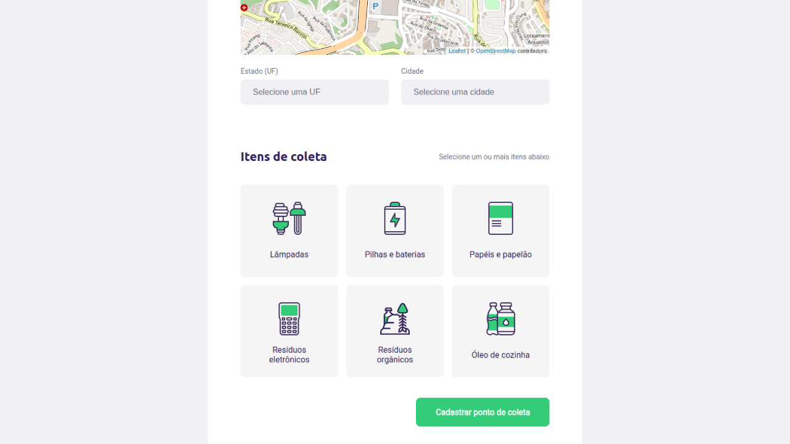

<p align="center">
    </img>
</p>

<p align="center" style="margin: 50px">
  <a href="https://github.com/gcairesdev/ecoleta">
    </img>
  </a>
  <a href="https://github.com/gcairesdev/ecoleta/blob/master/LICENSE.md">
    </img>
  </a>
  <a href="https://github.com/gcairesdev/ecoleta">
    </img>
  </a>
</p>

# Índice

* [Sobre o projeto](#Ecoleta)
  * [Feito com](#feito-com)
  * [Objetivo](#objetivo)
  * [Justificativa](#justificativa)
* [Iniciando](#iniciando)
  * [Pré requisitos](#pré-requisitos)
  * [Instalação](#instalação)
* [Contribuindo](#contribuindo)
* [Autor](#autor)
* [Licença](#licença)

# Ecoleta

> Realiza o cadastro e listagem de pontos de coleta e de itens para reciclagem.

O Ecoleta é um projeto ambiental responsável por cadastrar e listar pontos de coleta para reciclagem de produtos, com objetivo de ajudar o meio ambiente.

<p align="center">
  </img>
  </img>
  </img>
  </img>
  </img>
  </img>
</p>

## Feito com
* [NodeJS](https://nodejs.org/)
* [ReactJS](https://reactjs.org/)
* [React Native](https://reactnative.dev/)
* [Expo](https://expo.dev/)

## Objetivo

Este projeto, motivado pelo Dia Nacional da Reciclagem (05 de junho), visa incentivar e lembrar da importância de cuidar do meio ambiente. Trazendo uma solução através do cadastro de pontos de reciclagem.

## Justificativa

Este projeto foi desenvolvido durante a primeira Next Level Week, da RocketSeat. Foi realizado para fins de estudo, onde foi possível aprender mais sobre Node, React e React Native.

## Iniciando

Para iniciar, veja os pré requisitos do projeto.

## Pré requisitos
* [NodeJS](https://nodejs.org/)

## Instalação

Clone o repositório:

```git
git clone https://github.com/gcairesdev/ecoleta
```

Entre na pasta do projeto:

```sh
cd ecoleta
```

Instale as dependências:

```sh
cd server && npm i && cd ../web && npm i && cd ../mobile && npm i && cd ..
```

Crie e popule o banco de dados:

```sh
cd server && npm run db:migrate && npm run db:seed && cd ..
```

Inicie o server:

```sh
cd server && npm run dev
```

Inicie o web:

```sh
cd web && npm run dev
```

Inicie o mobile:

```sh
cd ../mobile && npm run dev
```

Use o [Expo][Expo] para abrir o app, através do QRcode

## Autor

|                |                  |          |            |         |
|----------------|------------------|----------|------------|---------|
| ![][githubImg] | Guilherme Caires | [Github] | [Linkedin] | [Email] |

## Contribuindo

Confira a página [CONTRIBUTING](./CONTRIBUTING.md) para ver os melhores locais para arquivar problemas, iniciar discussões e começar a contribuir.

## Licença

Lançado em 2020.
Este projeto está sob a [Licença MIT](./LICENSE.md).

---

<p align="center">
  Feito com :heart: por <a href="https://github.com/gcairesdev">Guilherme Caires</a>
</p>

<!-- Markdown link & img dfn's -->
[Github]: https://github.com/gcairesdev
[GithubImg]: https://avatars.githubusercontent.com/u/54117888?s=100
[Linkedin]: https://linkedin.com/in/guilherme-caires/
[Email]: contatogcaires@gmail.com
[Expo]: https://play.google.com/store/apps/details?id=host.exp.exponent&hl=pt_BR&gl=US
